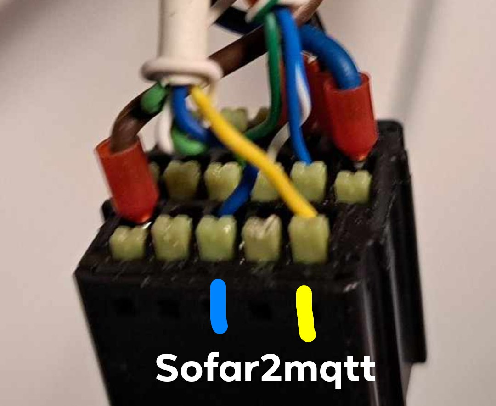
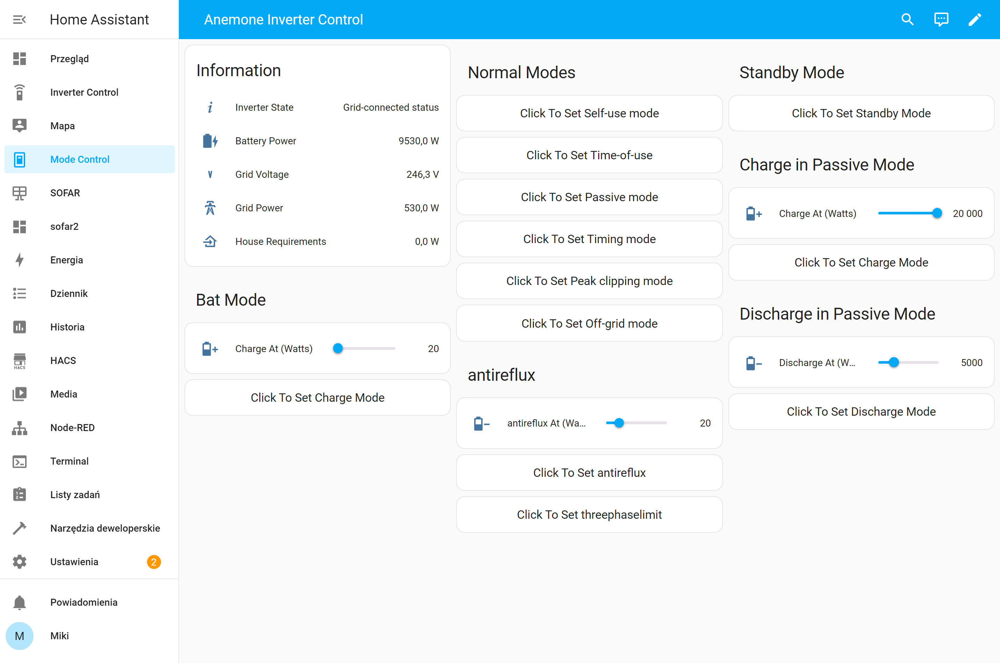

# Sofar2mqtt
## A smart home interface for Sofar solar and battery inverters.

Supported models:  

ME3000SP - Full support  
HYD-xx00-ES - Full support  
HYD-xx00-EP - Full support  
HYD-xx00-KTL - Full support  

Sofar2mqtt is a remote control interface for Sofar solar and battery inverters.
It allows remote control of the inverter and reports the invertor status, power usage, battery state etc for integration with smart home systems such as [Home Assistant](https://www.home-assistant.io/) and [Node-Red](https://nodered.org/). 
[Full instructions to get going with a Sofar2mqtt, Raspberry Pi and Home Assistant](https://github.com/dxoverdy/Integrating-Sofar2mqtt-with-Home-Assistant/tree/master)

For read only mode, it will send status messages without the inverter needing to be in passive mode.  
It's designed to run on an ESP8266 microcontroller with a TTL to RS485 module such as MAX485 or MAX3485.  
Designed to work with TTL modules with or without the DR and RE flow control pins. If your TTL module does not have these pins then just ignore the wire from D5. 

Subscribe your MQTT client to:

Sofar2mqtt/state (where Sofar2mqtt matches the hostname you configured in settings)

Which provides:

running_state  
grid_voltage  
grid_current  
grid_freq  
systemIO_power (AC side of inverter)  
battery_power  (DC side of inverter)  
battery_voltage  
battery_current  
batterySOC  
battery_temp  
battery_cycles  
grid_power  
consumption  
solarPV  
today_generation  
today_exported  
today_purchase  
today_consumption  
inverter_temp  
inverterHS_temp  
solarPVAmps  

With the inverter in Passive Mode, send MQTT messages to:

Sofar2mqtt/set/standby   - send value "true"  
Sofar2mqtt/set/auto   - send value "true" or "battery_save"  
Sofar2mqtt/set/charge   - send values in the range 0-3000 (watts)  
Sofar2mqtt/set/discharge   - send values in the range 0-3000 (watts) 

battery_save is a hybrid auto mode that will charge from excess solar but not discharge.

(c)Colin McGerty 2021 colin@mcgerty.co.uk
Major version 2.0 rewrite by Adam Hill sidepipeukatgmaildotcom
Thanks to Rich Platts for hybrid model code and testing.  
calcCRC by angelo.compagnucci@gmail.com and jpmzometa@gmail.com  
Version 3.x rewrite by Igor Ybema to work on his module with TFT screen and to add more inverter types

# How to get a pre-made module

Just go ahead to this [Tindie](https://www.tindie.com/products/thehognl/esp12-f-with-rs485-modbus-and-optional-touch-tft/) store to get a pre-made module with this software.

# How To Build your own module

If you want to build your own module you should follow [this readme](MODULE.md)

# Flashing

Easiest to get started is to flash a pre-compiled binary. Get a [regular ESP flasher](https://github.com/esphome/esphome-flasher/releases), attach a module on your computer and  flash a [binary](https://github.com/IgorYbema/Sofar2mqtt/tree/mod/binaries) to the module.
If you want to compile your own version you'll need the libraries for the ESP8266. Follow [this guide](https://randomnerdtutorials.com/how-to-install-esp8266-board-arduino-ide/) if you haven't completed that step before.

Add a few more libraries using the Manage Libraries menu:
1. PubSubClient
2. Adafruit GFX
3. Adafruit SSD1306 Wemos Mini OLED
4. DoubleResetDetect
5. Adafruit_ILI9341
6. XPT2046_Touchscreen

(Even if you are not using the OLED or TFT screen, you should install the libraries or it will not compile.)

...and upload.

Run it on the desktop, not connected to your invertor, to test that wifi and mqtt are connected and see some messages in the serial monitor.
The OLED screen should show "Online" to indicate a connection to WiFi and MQTT. It will alternate between "RS485 Error" and "CRC-FAULT" to indicate that the inverter is not connected.

# Connect to Inverter

Connect the Sofar2mqtt unit to a 5v micro USB power supply.
Now connect wires A and B to the two wire RS485 input of your inverter, which is marked as 485s on the image of the inverter below.

# Integrating Sofar2mqtt with Home Assistant

[Full instructions to get going with a Sofar2mqtt, Raspberry Pi and Home Assistant](https://github.com/dxoverdy/Integrating-Sofar2mqtt-with-Home-Assistant/tree/master)

# Troubleshooting

Nothing on the OLED or TFT screen? Make sure you solder all the pins on the OLED and ESP8266, not just those with wires attached.  
No communication with the inverter? Make sure the slave IDs match. Sofar2mqtt assumes slave ID 1 by default. You can change this around line 93 or in the inverter user interface. But they must be the same.   

Here's what the various things on the OLED screen tell you:

Line 1 is the device name, nothing else.  
Line 2 will display "Connecting" during start up and lines 3 and 4 will show WIFI and MQTT getting connected.  
Line 2 also has a dot that slowly flashes, once every few seconds. This is when a heartbeat message is being sent to the inverter.  
If a message is read from the inverter that fails the CRC checksum, line 3 will display "CRC-FAULT". This could be caused by a loose or bad RS485 wire or by unsupported features. A few of these is normal, a lot could indicate a problem.  
If no response is received to a heartbeat message, lines 3 and 4 show "RS485 ERROR". This could be caused by disconnected or reversed RS485 wires.  
During start-up, line 4 shows the Sofar2mqtt software version. Check that you have the latest version at https://github.com/cmcgerty/Sofar2MQTT  
In normal operation, line 2 shows "Online" which indicates that both WIFI and MQTT are still connected.  
In normal operation, line 3 shows the inverter run state, Standby, Charging, Discharging etc.  
In normal operation, line 4 shows the power in Watts in or out of the batteries when charging or discharging.  

